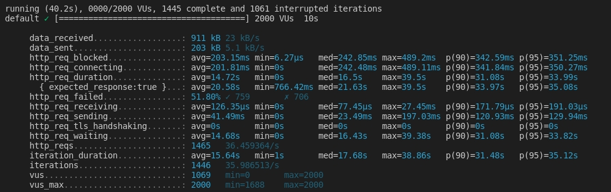
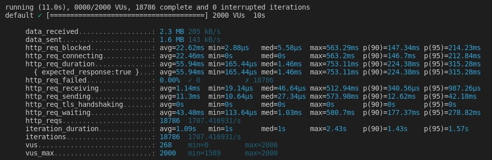
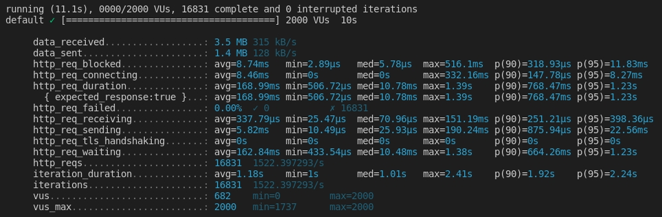

# K6

Load tests api on different platforms using K6

## Prepare environment

- Modify /etc/systemd/user.conf and /etc/systemd/system.conf with the following line (this takes care of graphical login):

```
 DefaultLimitNOFILE=65535
```

- Modify /etc/security/limits.conf with the following lines (this takes care of non-GUI login):

```
 * hard nofile 65535
 * soft nofile 65535
```

- Reboot your computer for changes to take effect.
- Increase open files run **ulimit -n 65535**
- install k6 https://k6.io/
- run comand `docker-compose up --build -d`

## Computer

- HP Elitebook 8440p
- Intel(R) Core(TM) i5 CPU
- RAM 8Gb

## PHP (Laravel)

```properties
$ k6 run ./K6_scripts/php_ping.js
```



## Go (Gin)

```properties
$ k6 run ../K6_scripts/go_ping.js
```



## Node (Express)

```properties
$ k6 run ../K6_scripts/node_ping.js
```


